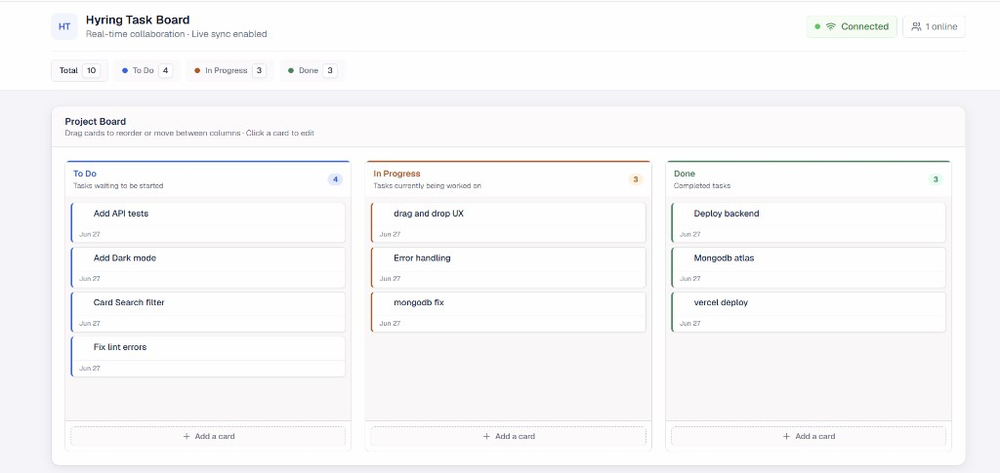
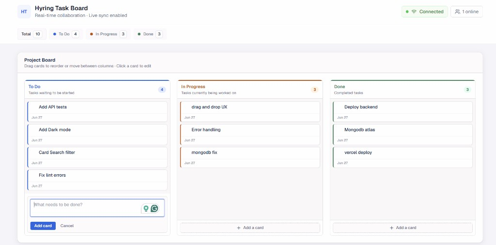
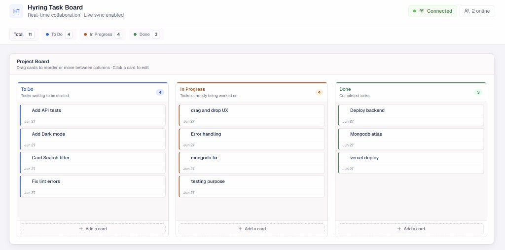
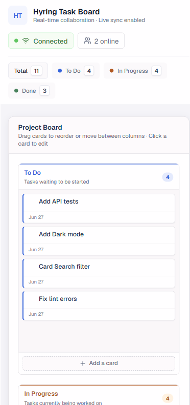

# Hyring Task Board

A real-time collaborative Kanban task board with three columns (**To Do**, **In Progress**, **Done**). Multiple users can add, rename, move, and delete cards; changes persist in MongoDB and sync live across all open browsers.

**Live app:** [https://hyring-task-board.vercel.app/](https://hyring-task-board.vercel.app/)

**Repository:** [https://github.com/Mugunthan03/hyring-task-board](https://github.com/Mugunthan03/hyring-task-board)

---

## Submission checklist

| Requirement | Location |
|-------------|----------|
| Git repository with commit history | [GitHub repo](https://github.com/Mugunthan03/hyring-task-board) |
| README (setup, env vars, bonuses) | This file |
| `.env.example` | [`backend/.env.example`](backend/.env.example), [`frontend/.env.example`](frontend/.env.example) |
| Schema | [`backend/models/Card.js`](backend/models/Card.js) (Mongoose model) |
| Key decisions & trade-offs | [Design decisions](#design-decisions-trade-offs--future-improvements) below |

---

## Overview

Monorepo layout:

```
hyring-task-board/
├── frontend/          # Next.js 16 + React 19 + Tailwind CSS
├── backend/           # Express 5 + Socket.io + Mongoose
│   ├── models/        # Mongoose schemas (Card collection)
│   ├── services/      # Database queries
│   ├── controllers/   # HTTP handlers
│   ├── routes/        # REST routes
│   └── socket/        # Real-time events
├── backend/.env.example
├── frontend/.env.example
└── README.md
```

Data is stored in a MongoDB `cards` collection, defined and queried through **Mongoose**. The API exposes `_id` as `id` in JSON responses via `backend/utils/serializeCard.js`.

---

## Screenshots

### Desktop — Kanban board

Three-column board with task counts, connection status, and online presence.



### Desktop — Add a card

Inline form to create a new task in any column.



### Desktop — Real-time sync

Live collaboration across browsers — online count updates as users join (e.g. **2 online**).



### Mobile — Responsive layout

Board stacks vertically on smaller screens for easy scrolling on phones and tablets.



---

## Features

### Required (all implemented)

- **Persistent board** — Cards stored in MongoDB with `id`, `title`, `status`, `position`, timestamps
- **Full CRUD** — Create, rename, move, and delete cards via REST API
- **Live WebSocket sync** — Socket.io broadcasts `card:created`, `card:updated`, `card:deleted` after every successful write
- **No double-apply** — `x-client-id` header + `originClientId` filtering so the originating client ignores its own broadcast
- **Reconnect handling** — Connection pill shows Connected / Reconnecting; `board:sync` sends full state on connect

### Bonuses

| Bonus | Status | Notes |
|-------|--------|-------|
| **Presence** (`👥 N online`) | ✅ Done | Server tracks Socket.io connections; emits `presence:update` |
| **Drag & drop** | ✅ Done | `@dnd-kit` — reorder within a column and move between columns; persists `position` via PATCH |
| **Conflict handling** | ⏭️ Skipped | `version` field is stored and incremented on update, but no optimistic-locking / 409 responses yet; last-write-wins |

### Extra (not in brief, added for polish)

- Optimistic UI updates with rollback on API failure
- Loading skeleton and error banner
- Deployed frontend on Vercel
- Jira-inspired responsive UI

---

## Tech stack

| Layer | Technology |
|-------|------------|
| Frontend | Next.js 16, React 19, Tailwind CSS 4 |
| Drag & drop | `@dnd-kit/core`, `@dnd-kit/sortable` |
| Real-time client | `socket.io-client` |
| Backend | Node.js, Express 5, Socket.io |
| Database | MongoDB |
| ORM | Mongoose |
| Deployment | Vercel (frontend) |

---

## MongoDB schema

The `Card` model is defined in [`backend/models/Card.js`](backend/models/Card.js):

| Field | Type | Notes |
|-------|------|-------|
| `_id` | ObjectId | Auto-generated; exposed as `id` in API responses |
| `title` | String | Required, trimmed, max 200 characters |
| `status` | String | `"todo"` \| `"in_progress"` \| `"done"` |
| `position` | Number | Order within a column (0, 1, 2, …) |
| `version` | Number | Incremented on each update (for future conflict handling) |
| `createdAt` | Date | Set automatically by Mongoose `timestamps` |
| `updatedAt` | Date | Set automatically by Mongoose `timestamps` |

**Index:** `{ status: 1, position: 1 }` — keeps column queries and sorting fast.

MongoDB creates the `cards` collection automatically on first insert. No manual migration step is required — start the backend with a valid `MONGO_URI` and Mongoose handles the rest.

---

## Environment variables

Copy the example files and fill in your values:

```bash
cp backend/.env.example backend/.env
cp frontend/.env.example frontend/.env.local
```

### Backend (`backend/.env`)

| Variable | Required | Description |
|----------|----------|-------------|
| `PORT` | No | API + WebSocket port (default `5000`) |
| `CLIENT_URL` | Yes | Frontend URL for CORS and Socket.io (e.g. `http://localhost:3000`) |
| `MONGO_URI` | Yes | MongoDB connection string |

**Example `MONGO_URI` values:**

```env
# Local MongoDB
MONGO_URI=mongodb://127.0.0.1:27017/hyring-task-board

# MongoDB Atlas
MONGO_URI=mongodb+srv://<user>:<password>@<cluster>.mongodb.net/hyring-task-board
```

### Frontend (`frontend/.env.local`)

| Variable | Required | Description |
|----------|----------|-------------|
| `NEXT_PUBLIC_API_URL` | Yes | Backend REST base URL (e.g. `http://localhost:5000`) |
| `NEXT_PUBLIC_WS_URL` | Yes | Backend WebSocket URL (same host/port as API) |

### Production (Vercel)

```env
NEXT_PUBLIC_API_URL=https://your-backend-domain.com
NEXT_PUBLIC_WS_URL=https://your-backend-domain.com
```

Set `CLIENT_URL=https://hyring-task-board.vercel.app` on the backend server.

---

## Run locally

### Prerequisites

- Node.js 18+
- MongoDB — local install, Docker, or [MongoDB Atlas](https://www.mongodb.com/atlas) free tier

### 1. Clone the repository

```bash
git clone https://github.com/Mugunthan03/hyring-task-board.git
cd hyring-task-board
```

### 2. Start MongoDB

**Local (if installed):** ensure MongoDB is running on `127.0.0.1:27017`.

**Docker:**

```bash
docker run -d --name mongodb -p 27017:27017 mongo:7
```

**Atlas:** create a free cluster, copy the connection string into `MONGO_URI`.

### 3. Backend

```bash
cd backend
npm install
cp .env.example .env
# Edit .env — set MONGO_URI and CLIENT_URL
npm run dev
```

You should see:

```
db connected
server running on port 5000
```

### 4. Frontend (new terminal)

```bash
cd frontend
npm install
cp .env.example .env.local
npm run dev
```

Open [http://localhost:3000](http://localhost:3000).

### 5. Acceptance test

1. Open the app in **two browser windows** side by side
2. Add a card in window 1 → appears in window 2 without refresh
3. Rename, move, or delete in either window → the other updates instantly
4. Refresh both → board state persists from MongoDB
5. Stop the backend briefly → frontend shows Reconnecting, then recovers

---

## API & WebSocket reference

### REST

| Method | Endpoint | Description |
|--------|----------|-------------|
| `GET` | `/api/cards` | List all cards (sorted by status, position) |
| `POST` | `/api/cards` | Create `{ title, status }` |
| `PATCH` | `/api/cards/:id` | Update `{ title?, status?, position? }` |
| `DELETE` | `/api/cards/:id` | Delete card |

All mutating requests should include header: `x-client-id: <uuid>`.

### Socket.io events

| Event | Direction | Payload |
|-------|-----------|---------|
| `board:sync` | Server → Client | `{ cards }` on connect |
| `card:created` | Server → Client | `{ card, originClientId }` |
| `card:updated` | Server → Client | `{ card, originClientId }` |
| `card:deleted` | Server → Client | `{ id, originClientId }` |
| `presence:update` | Server → Client | `{ count }` |

---

## Design decisions, trade-offs & future improvements

### Key decisions

- **MongoDB + Mongoose** — A single `cards` collection fits the board model well. Mongoose gives schema validation, enums, indexes, and timestamps without manual SQL migrations.
- **Separate Express backend** — Socket.io and REST share one HTTP server on the same port. Keeps WebSocket logic out of Next.js and simplifies CORS.
- **REST writes, Socket broadcasts** — All persistence goes through Express routes; sockets only notify clients. Avoids race conditions from socket-only writes.
- **Optimistic UI** — Cards update immediately in the browser; failed API calls roll back local state.
- **`x-client-id` deduplication** — Each browser gets a stable UUID in `sessionStorage`; server echoes it so the author does not apply the same event twice.

### Trade-offs

- **Last-write-wins** — No conflict detection despite a `version` field; two users editing the same card at once may overwrite each other.
- **Single shared board** — No auth, workspaces, or per-user boards (out of scope per brief).
- **Position updates** — Moving a card updates its position but does not renumber all siblings in the source column (acceptable for a small board).

### With more time I would

- Implement full **conflict handling** — require `version` on PATCH, return `409 Conflict`, and refetch on mismatch
- Add **integration tests** for API and socket events
- **Renumber positions** atomically when cards move between columns
- Add **Docker Compose** for one-command local setup (MongoDB + backend + frontend)
- Deploy backend with **HTTPS + Nginx** and document the full production topology
- Add **keyboard shortcuts** and accessibility improvements for drag-and-drop

---

## Git history

Commits are small and incremental:

```
6cc078b feat: created frontend and backend folder structure
ce8a20b feat: created backend logic for task board
789501e feat: add frontend task board ui
3d8b07e feat: added vercel json file
```

---

## License

ISC
